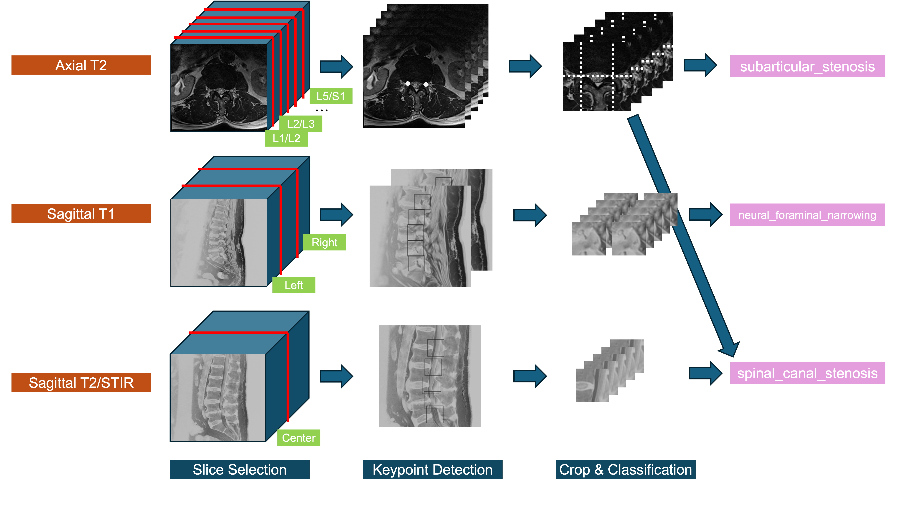

# RSNA 2024 Lumbar Spine Degenerative Classification - 4th Place Solution
This is the implementation of the 4th place solution (yu4u's part) for [RSNA 2024 Lumbar Spine Degenerative Classification](https://www.kaggle.com/competitions/rsna-2024-lumbar-spine-degenerative-classification/) at Kaggle.
The overall solution is described in [this discussion](https://www.kaggle.com/competitions/rsna-2024-lumbar-spine-degenerative-classification/discussion/539443).



## Requirements
- 24GB x 2 VRAM (trained on GeForce RTX 3090 x 2).

## Preparation
- Download the competition dataset from [here](https://www.kaggle.com/competitions/rsna-2024-lumbar-spine-degenerative-classification/data) and put them in `input` directory.
- Install Docker/NVIDIA Container Toolkit.
- Build the Docker image and enter the Docker container:
    ```shell
    export UID=$(id -u)
    docker compose up -d
    docker compose exec dev /bin/bash
    ```
- Login to wandb:
    ```shell
    wandb login


## Training Process

### Axial Depth Model
```bash
# Create axial dataset for depth prediction.
python 01_create_axial_dataset.py --dirname axial_dataset_128 --img_size 128

# Train axial depth model.
python 02_axial_train.py trainer.accelerator=gpu trainer.devices=-1 trainer.strategy=ddp_find_unused_parameters_true data.batch_size=8 trainer.precision=16 data.num_workers=12 trainer.max_epochs=256 wandb.name=axial_depth_fold0 opt.lr=2e-3 opt.opt=AdamW opt.weight_decay=0 scheduler.min_lr=0 trainer.deterministic=False task.img_size=128 task.depth=32 model.ema=True model.ema_decay=0.9995 trainer.check_val_every_n_epoch=8 task.in_channels=3 task.layer_num=1 task.dirname=axial_dataset_128 data.fold_id=0
python 02_axial_train.py trainer.accelerator=gpu trainer.devices=-1 trainer.strategy=ddp_find_unused_parameters_true data.batch_size=8 trainer.precision=16 data.num_workers=12 trainer.max_epochs=256 wandb.name=axial_depth_fold1 opt.lr=2e-3 opt.opt=AdamW opt.weight_decay=0 scheduler.min_lr=0 trainer.deterministic=False task.img_size=128 task.depth=32 model.ema=True model.ema_decay=0.9995 trainer.check_val_every_n_epoch=8 task.in_channels=3 task.layer_num=1 task.dirname=axial_dataset_128 data.fold_id=1
python 02_axial_train.py trainer.accelerator=gpu trainer.devices=-1 trainer.strategy=ddp_find_unused_parameters_true data.batch_size=8 trainer.precision=16 data.num_workers=12 trainer.max_epochs=256 wandb.name=axial_depth_fold2 opt.lr=2e-3 opt.opt=AdamW opt.weight_decay=0 scheduler.min_lr=0 trainer.deterministic=False task.img_size=128 task.depth=32 model.ema=True model.ema_decay=0.9995 trainer.check_val_every_n_epoch=8 task.in_channels=3 task.layer_num=1 task.dirname=axial_dataset_128 data.fold_id=2
python 02_axial_train.py trainer.accelerator=gpu trainer.devices=-1 trainer.strategy=ddp_find_unused_parameters_true data.batch_size=8 trainer.precision=16 data.num_workers=12 trainer.max_epochs=256 wandb.name=axial_depth_fold3 opt.lr=2e-3 opt.opt=AdamW opt.weight_decay=0 scheduler.min_lr=0 trainer.deterministic=False task.img_size=128 task.depth=32 model.ema=True model.ema_decay=0.9995 trainer.check_val_every_n_epoch=8 task.in_channels=3 task.layer_num=1 task.dirname=axial_dataset_128 data.fold_id=3
python 02_axial_train.py trainer.accelerator=gpu trainer.devices=-1 trainer.strategy=ddp_find_unused_parameters_true data.batch_size=8 trainer.precision=16 data.num_workers=12 trainer.max_epochs=256 wandb.name=axial_depth_fold4 opt.lr=2e-3 opt.opt=AdamW opt.weight_decay=0 scheduler.min_lr=0 trainer.deterministic=False task.img_size=128 task.depth=32 model.ema=True model.ema_decay=0.9995 trainer.check_val_every_n_epoch=8 task.in_channels=3 task.layer_num=1 task.dirname=axial_dataset_128 data.fold_id=4

# Create axial dataset for test.
python 05_create_test_axial_dataset.py --mode val --target axial

# Test axial depth model.
python 03_axial_test.py test.mode=val trainer.accelerator=gpu trainer.devices=[0] data.num_workers=10 task.img_size=128 task.in_channels=3 task.layer_num=1 data.fold_id=0 model.resume_path=saved_models/axial_depth2_fold0 test.tta=True
python 03_axial_test.py test.mode=val trainer.accelerator=gpu trainer.devices=[0] data.num_workers=10 task.img_size=128 task.in_channels=3 task.layer_num=1 data.fold_id=1 model.resume_path=saved_models/axial_depth2_fold1 test.tta=True
python 03_axial_test.py test.mode=val trainer.accelerator=gpu trainer.devices=[0] data.num_workers=10 task.img_size=128 task.in_channels=3 task.layer_num=1 data.fold_id=2 model.resume_path=saved_models/axial_depth2_fold2 test.tta=True
python 03_axial_test.py test.mode=val trainer.accelerator=gpu trainer.devices=[0] data.num_workers=10 task.img_size=128 task.in_channels=3 task.layer_num=1 data.fold_id=3 model.resume_path=saved_models/axial_depth2_fold3 test.tta=True
python 03_axial_test.py test.mode=val trainer.accelerator=gpu trainer.devices=[0] data.num_workers=10 task.img_size=128 task.in_channels=3 task.layer_num=1 data.fold_id=4 model.resume_path=saved_models/axial_depth2_fold4 test.tta=True
```

### Axial Keypoint Model

```bash
# Create axial keypoint dataset.
python 21_create_axial_keypoint_dataset.py --img_size 512 --dirname axial_keypoint_dataset_512

# Train axial keypoint model.
python 22_axial_keypoint_train.py --monitor val_keypoint_error trainer.accelerator=gpu trainer.devices=-1 trainer.strategy=ddp_find_unused_parameters_true data.batch_size=16 trainer.precision=16 data.num_workers=12 trainer.max_epochs=32 wandb.name=keypoint_v3_fold0 opt.lr=1e-3 opt.opt=AdamW opt.weight_decay=1e-2 scheduler.min_lr=0 task.img_size=512 model.ema=True model.ema_decay=0.995 task.dirname=axial_keypoint_dataset_512 trainer.deterministic=False data.fold_id=0
python 22_axial_keypoint_train.py --monitor val_keypoint_error trainer.accelerator=gpu trainer.devices=-1 trainer.strategy=ddp_find_unused_parameters_true data.batch_size=16 trainer.precision=16 data.num_workers=12 trainer.max_epochs=32 wandb.name=keypoint_v3_fold1 opt.lr=1e-3 opt.opt=AdamW opt.weight_decay=1e-2 scheduler.min_lr=0 task.img_size=512 model.ema=True model.ema_decay=0.995 task.dirname=axial_keypoint_dataset_512 trainer.deterministic=False data.fold_id=1
python 22_axial_keypoint_train.py --monitor val_keypoint_error trainer.accelerator=gpu trainer.devices=-1 trainer.strategy=ddp_find_unused_parameters_true data.batch_size=16 trainer.precision=16 data.num_workers=12 trainer.max_epochs=32 wandb.name=keypoint_v3_fold2 opt.lr=1e-3 opt.opt=AdamW opt.weight_decay=1e-2 scheduler.min_lr=0 task.img_size=512 model.ema=True model.ema_decay=0.995 task.dirname=axial_keypoint_dataset_512 trainer.deterministic=False data.fold_id=2
python 22_axial_keypoint_train.py --monitor val_keypoint_error trainer.accelerator=gpu trainer.devices=-1 trainer.strategy=ddp_find_unused_parameters_true data.batch_size=16 trainer.precision=16 data.num_workers=12 trainer.max_epochs=32 wandb.name=keypoint_v3_fold3 opt.lr=1e-3 opt.opt=AdamW opt.weight_decay=1e-2 scheduler.min_lr=0 task.img_size=512 model.ema=True model.ema_decay=0.995 task.dirname=axial_keypoint_dataset_512 trainer.deterministic=False data.fold_id=3
python 22_axial_keypoint_train.py --monitor val_keypoint_error trainer.accelerator=gpu trainer.devices=-1 trainer.strategy=ddp_find_unused_parameters_true data.batch_size=16 trainer.precision=16 data.num_workers=12 trainer.max_epochs=32 wandb.name=keypoint_v3_fold4 opt.lr=1e-3 opt.opt=AdamW opt.weight_decay=1e-2 scheduler.min_lr=0 task.img_size=512 model.ema=True model.ema_decay=0.995 task.dirname=axial_keypoint_dataset_512 trainer.deterministic=False data.fold_id=4

# Create axial keypoint dataset for test.
python 25_create_test_keypoint_dataset.py --mode val

# Test axial keypoint model.
python 23_axial_keypoint_test.py test.mode=val trainer.accelerator=gpu trainer.devices=[0] data.num_workers=10 data.batch_size=32 task.img_size=512 data.fold_id=0 model.resume_path=saved_models/keypoint_v3_fold0 test.tta=True
python 23_axial_keypoint_test.py test.mode=val trainer.accelerator=gpu trainer.devices=[0] data.num_workers=10 data.batch_size=32 task.img_size=512 data.fold_id=1 model.resume_path=saved_models/keypoint_v3_fold1 test.tta=True
python 23_axial_keypoint_test.py test.mode=val trainer.accelerator=gpu trainer.devices=[0] data.num_workers=10 data.batch_size=32 task.img_size=512 data.fold_id=2 model.resume_path=saved_models/keypoint_v3_fold2 test.tta=True
python 23_axial_keypoint_test.py test.mode=val trainer.accelerator=gpu trainer.devices=[0] data.num_workers=10 data.batch_size=32 task.img_size=512 data.fold_id=3 model.resume_path=saved_models/keypoint_v3_fold3 test.tta=True
python 23_axial_keypoint_test.py test.mode=val trainer.accelerator=gpu trainer.devices=[0] data.num_workers=10 data.batch_size=32 task.img_size=512 data.fold_id=4 model.resume_path=saved_models/keypoint_v3_fold4 test.tta=True
```

### Axial Classification Model
```bash
# Create axial classification dataset from prediction.
python 14_create_axial_cls_dataset_from_pred_v2.py --channel_num 5 --img_size 224
python 17_add_axial_cls_dataset_from_gt.py  --channel_num 5 --img_size 224

# Train axial classification model.
# EfficientNetV2S
python 12_axial_cls_train.py trainer.accelerator=gpu trainer.devices=-1 trainer.strategy=ddp_find_unused_parameters_true data.batch_size=32 trainer.precision=16 data.num_workers=12 trainer.max_epochs=16 wandb.name=ch5_attn_hflip_fold0 opt.lr=2e-3 opt.opt=AdamW opt.weight_decay=0 scheduler.min_lr=0 task.img_size=224 model.ema=True model.ema_decay=0.99 task.dirname=axial_cls_all_dataset loss.mixup=0.3 model.arch=2.5d data.fold_id=0 model.in_channels=3
python 12_axial_cls_train.py trainer.accelerator=gpu trainer.devices=-1 trainer.strategy=ddp_find_unused_parameters_true data.batch_size=32 trainer.precision=16 data.num_workers=12 trainer.max_epochs=16 wandb.name=ch5_attn_hflip_fold1 opt.lr=2e-3 opt.opt=AdamW opt.weight_decay=0 scheduler.min_lr=0 task.img_size=224 model.ema=True model.ema_decay=0.99 task.dirname=axial_cls_all_dataset loss.mixup=0.3 model.arch=2.5d data.fold_id=1 model.in_channels=3
python 12_axial_cls_train.py trainer.accelerator=gpu trainer.devices=-1 trainer.strategy=ddp_find_unused_parameters_true data.batch_size=32 trainer.precision=16 data.num_workers=12 trainer.max_epochs=16 wandb.name=ch5_attn_hflip_fold2 opt.lr=2e-3 opt.opt=AdamW opt.weight_decay=0 scheduler.min_lr=0 task.img_size=224 model.ema=True model.ema_decay=0.99 task.dirname=axial_cls_all_dataset loss.mixup=0.3 model.arch=2.5d data.fold_id=2 model.in_channels=3
python 12_axial_cls_train.py trainer.accelerator=gpu trainer.devices=-1 trainer.strategy=ddp_find_unused_parameters_true data.batch_size=32 trainer.precision=16 data.num_workers=12 trainer.max_epochs=16 wandb.name=ch5_attn_hflip_fold3 opt.lr=2e-3 opt.opt=AdamW opt.weight_decay=0 scheduler.min_lr=0 task.img_size=224 model.ema=True model.ema_decay=0.99 task.dirname=axial_cls_all_dataset loss.mixup=0.3 model.arch=2.5d data.fold_id=3 model.in_channels=3
python 12_axial_cls_train.py trainer.accelerator=gpu trainer.devices=-1 trainer.strategy=ddp_find_unused_parameters_true data.batch_size=32 trainer.precision=16 data.num_workers=12 trainer.max_epochs=16 wandb.name=ch5_attn_hflip_fold4 opt.lr=2e-3 opt.opt=AdamW opt.weight_decay=0 scheduler.min_lr=0 task.img_size=224 model.ema=True model.ema_decay=0.99 task.dirname=axial_cls_all_dataset loss.mixup=0.3 model.arch=2.5d data.fold_id=4 model.in_channels=3

# Swin-T
python 12_axial_cls_train.py trainer.accelerator=gpu trainer.devices=-1 trainer.strategy=ddp_find_unused_parameters_true data.batch_size=32 trainer.precision=16 data.num_workers=12 trainer.max_epochs=16 wandb.name=ch5_swin_t_fold0 opt.lr=2e-4 opt.opt=AdamW opt.weight_decay=0 scheduler.min_lr=0 task.img_size=224 model.ema=True model.ema_decay=0.99 task.dirname=axial_cls_all_dataset loss.mixup=0.3 model.arch=2.5d data.fold_id=0 model.in_channels=3 model.backbone=swin_tiny_patch4_window7_224.ms_in22k_ft_in1k
python 12_axial_cls_train.py trainer.accelerator=gpu trainer.devices=-1 trainer.strategy=ddp_find_unused_parameters_true data.batch_size=32 trainer.precision=16 data.num_workers=12 trainer.max_epochs=16 wandb.name=ch5_swin_t_fold1 opt.lr=2e-4 opt.opt=AdamW opt.weight_decay=0 scheduler.min_lr=0 task.img_size=224 model.ema=True model.ema_decay=0.99 task.dirname=axial_cls_all_dataset loss.mixup=0.3 model.arch=2.5d data.fold_id=1 model.in_channels=3 model.backbone=swin_tiny_patch4_window7_224.ms_in22k_ft_in1k
python 12_axial_cls_train.py trainer.accelerator=gpu trainer.devices=-1 trainer.strategy=ddp_find_unused_parameters_true data.batch_size=32 trainer.precision=16 data.num_workers=12 trainer.max_epochs=16 wandb.name=ch5_swin_t_fold2 opt.lr=2e-4 opt.opt=AdamW opt.weight_decay=0 scheduler.min_lr=0 task.img_size=224 model.ema=True model.ema_decay=0.99 task.dirname=axial_cls_all_dataset loss.mixup=0.3 model.arch=2.5d data.fold_id=2 model.in_channels=3 model.backbone=swin_tiny_patch4_window7_224.ms_in22k_ft_in1k
python 12_axial_cls_train.py trainer.accelerator=gpu trainer.devices=-1 trainer.strategy=ddp_find_unused_parameters_true data.batch_size=32 trainer.precision=16 data.num_workers=12 trainer.max_epochs=16 wandb.name=ch5_swin_t_fold3 opt.lr=2e-4 opt.opt=AdamW opt.weight_decay=0 scheduler.min_lr=0 task.img_size=224 model.ema=True model.ema_decay=0.99 task.dirname=axial_cls_all_dataset loss.mixup=0.3 model.arch=2.5d data.fold_id=3 model.in_channels=3 model.backbone=swin_tiny_patch4_window7_224.ms_in22k_ft_in1k
python 12_axial_cls_train.py trainer.accelerator=gpu trainer.devices=-1 trainer.strategy=ddp_find_unused_parameters_true data.batch_size=32 trainer.precision=16 data.num_workers=12 trainer.max_epochs=16 wandb.name=ch5_swin_t_fold4 opt.lr=2e-4 opt.opt=AdamW opt.weight_decay=0 scheduler.min_lr=0 task.img_size=224 model.ema=True model.ema_decay=0.99 task.dirname=axial_cls_all_dataset loss.mixup=0.3 model.arch=2.5d data.fold_id=4 model.in_channels=3 model.backbone=swin_tiny_patch4_window7_224.ms_in22k_ft_in1k
```

### Sagittal1 Depth Model
```bash
# Create sagittal1 dataset for depth prediction.
python 06_create_sagittal1_dataset.py

# Train sagittal1 depth model.
python 02_axial_train.py trainer.accelerator=gpu trainer.devices=-1 trainer.strategy=ddp_find_unused_parameters_true data.batch_size=8 trainer.precision=16 data.num_workers=12 trainer.max_epochs=256 wandb.name=sagittal1_depth2_fold0 opt.lr=1e-3 opt.opt=AdamW opt.weight_decay=0 scheduler.min_lr=0 trainer.deterministic=False task.img_size=128 task.depth=16 model.ema=True model.ema_decay=0.9995 trainer.check_val_every_n_epoch=8 task.in_channels=3 task.layer_num=1 task.dirname=sagittal1_dataset data.fold_id=0
python 02_axial_train.py trainer.accelerator=gpu trainer.devices=-1 trainer.strategy=ddp_find_unused_parameters_true data.batch_size=8 trainer.precision=16 data.num_workers=12 trainer.max_epochs=256 wandb.name=sagittal1_depth2_fold1 opt.lr=1e-3 opt.opt=AdamW opt.weight_decay=0 scheduler.min_lr=0 trainer.deterministic=False task.img_size=128 task.depth=16 model.ema=True model.ema_decay=0.9995 trainer.check_val_every_n_epoch=8 task.in_channels=3 task.layer_num=1 task.dirname=sagittal1_dataset data.fold_id=1
python 02_axial_train.py trainer.accelerator=gpu trainer.devices=-1 trainer.strategy=ddp_find_unused_parameters_true data.batch_size=8 trainer.precision=16 data.num_workers=12 trainer.max_epochs=256 wandb.name=sagittal1_depth2_fold2 opt.lr=1e-3 opt.opt=AdamW opt.weight_decay=0 scheduler.min_lr=0 trainer.deterministic=False task.img_size=128 task.depth=16 model.ema=True model.ema_decay=0.9995 trainer.check_val_every_n_epoch=8 task.in_channels=3 task.layer_num=1 task.dirname=sagittal1_dataset data.fold_id=2
python 02_axial_train.py trainer.accelerator=gpu trainer.devices=-1 trainer.strategy=ddp_find_unused_parameters_true data.batch_size=8 trainer.precision=16 data.num_workers=12 trainer.max_epochs=256 wandb.name=sagittal1_depth2_fold3 opt.lr=1e-3 opt.opt=AdamW opt.weight_decay=0 scheduler.min_lr=0 trainer.deterministic=False task.img_size=128 task.depth=16 model.ema=True model.ema_decay=0.9995 trainer.check_val_every_n_epoch=8 task.in_channels=3 task.layer_num=1 task.dirname=sagittal1_dataset data.fold_id=3
python 02_axial_train.py trainer.accelerator=gpu trainer.devices=-1 trainer.strategy=ddp_find_unused_parameters_true data.batch_size=8 trainer.precision=16 data.num_workers=12 trainer.max_epochs=256 wandb.name=sagittal1_depth2_fold4 opt.lr=1e-3 opt.opt=AdamW opt.weight_decay=0 scheduler.min_lr=0 trainer.deterministic=False task.img_size=128 task.depth=16 model.ema=True model.ema_decay=0.9995 trainer.check_val_every_n_epoch=8 task.in_channels=3 task.layer_num=1 task.dirname=sagittal1_dataset data.fold_id=4

# Create sagittal1 dataset for test.
python 05_create_test_axial_dataset.py --mode val --target sagittal1

# Test sagittal1 depth model.
python 03_axial_test.py test.target=sagittal1 test.mode=val trainer.accelerator=gpu trainer.devices=[0] data.num_workers=10 task.img_size=128 task.in_channels=3 task.layer_num=1 data.fold_id=0 model.resume_path=saved_models/sagittal1_depth2_fold0
python 03_axial_test.py test.target=sagittal1 test.mode=val trainer.accelerator=gpu trainer.devices=[0] data.num_workers=10 task.img_size=128 task.in_channels=3 task.layer_num=1 data.fold_id=1 model.resume_path=saved_models/sagittal1_depth2_fold1
python 03_axial_test.py test.target=sagittal1 test.mode=val trainer.accelerator=gpu trainer.devices=[0] data.num_workers=10 task.img_size=128 task.in_channels=3 task.layer_num=1 data.fold_id=2 model.resume_path=saved_models/sagittal1_depth2_fold2
python 03_axial_test.py test.target=sagittal1 test.mode=val trainer.accelerator=gpu trainer.devices=[0] data.num_workers=10 task.img_size=128 task.in_channels=3 task.layer_num=1 data.fold_id=3 model.resume_path=saved_models/sagittal1_depth2_fold3
python 03_axial_test.py test.target=sagittal1 test.mode=val trainer.accelerator=gpu trainer.devices=[0] data.num_workers=10 task.img_size=128 task.in_channels=3 task.layer_num=1 data.fold_id=4 model.resume_path=saved_models/sagittal1_depth2_fold4
```

### Sagittal1 Keypoint Model
```bash
# Create sagittal1 keypoint dataset.
python 28_create_sagittal1_keypoint_dataset_from_improved.py

# Train sagittal1 keypoint model.
python 22_axial_keypoint_train.py --monitor val_keypoint_error trainer.accelerator=gpu trainer.devices=-1 trainer.strategy=ddp_find_unused_parameters_true data.batch_size=8 trainer.precision=16 data.num_workers=12 trainer.max_epochs=32 wandb.name=sagittal1_keypoint_v2_bs8_lr2e-3_fold0 opt.lr=2e-3 opt.opt=AdamW opt.weight_decay=1e-2 scheduler.min_lr=0 task.img_size=512 model.ema=True model.ema_decay=0.995 task.dirname=sagittal1_keypoint_dataset trainer.deterministic=False data.fold_id=0
python 22_axial_keypoint_train.py --monitor val_keypoint_error trainer.accelerator=gpu trainer.devices=-1 trainer.strategy=ddp_find_unused_parameters_true data.batch_size=8 trainer.precision=16 data.num_workers=12 trainer.max_epochs=32 wandb.name=sagittal1_keypoint_v2_bs8_lr2e-3_fold1 opt.lr=2e-3 opt.opt=AdamW opt.weight_decay=1e-2 scheduler.min_lr=0 task.img_size=512 model.ema=True model.ema_decay=0.995 task.dirname=sagittal1_keypoint_dataset trainer.deterministic=False data.fold_id=1
python 22_axial_keypoint_train.py --monitor val_keypoint_error trainer.accelerator=gpu trainer.devices=-1 trainer.strategy=ddp_find_unused_parameters_true data.batch_size=8 trainer.precision=16 data.num_workers=12 trainer.max_epochs=32 wandb.name=sagittal1_keypoint_v2_bs8_fold2 opt.lr=1e-3 opt.opt=AdamW opt.weight_decay=1e-2 scheduler.min_lr=0 task.img_size=512 model.ema=True model.ema_decay=0.995 task.dirname=sagittal1_keypoint_dataset trainer.deterministic=False data.fold_id=2
python 22_axial_keypoint_train.py --monitor val_keypoint_error trainer.accelerator=gpu trainer.devices=-1 trainer.strategy=ddp_find_unused_parameters_true data.batch_size=8 trainer.precision=16 data.num_workers=12 trainer.max_epochs=32 wandb.name=sagittal1_keypoint_v2_bs8_fold3 opt.lr=1e-3 opt.opt=AdamW opt.weight_decay=1e-2 scheduler.min_lr=0 task.img_size=512 model.ema=True model.ema_decay=0.995 task.dirname=sagittal1_keypoint_dataset trainer.deterministic=False data.fold_id=3
python 22_axial_keypoint_train.py --monitor val_keypoint_error trainer.accelerator=gpu trainer.devices=-1 trainer.strategy=ddp_find_unused_parameters_true data.batch_size=8 trainer.precision=16 data.num_workers=12 trainer.max_epochs=32 wandb.name=sagittal1_keypoint_v2_bs8_lr2e-3_fold4 opt.lr=2e-3 opt.opt=AdamW opt.weight_decay=1e-2 scheduler.min_lr=0 task.img_size=512 model.ema=True model.ema_decay=0.995 task.dirname=sagittal1_keypoint_dataset trainer.deterministic=False data.fold_id=4

# Create sagittal1 keypoint dataset for test.
python 27_create_test_sagittal1_keypoint_dataset.py

# Test sagittal1 keypoint model.
python 23_axial_keypoint_test.py test.mode=val test.target=sagittal1 trainer.accelerator=gpu trainer.devices=[0] data.num_workers=10 data.batch_size=32 task.img_size=512 data.fold_id=0 model.resume_path=saved_models/sagittal1_keypoint_v2_bs8_lr2e-3_fold0
python 23_axial_keypoint_test.py test.mode=val test.target=sagittal1 trainer.accelerator=gpu trainer.devices=[0] data.num_workers=10 data.batch_size=32 task.img_size=512 data.fold_id=1 model.resume_path=saved_models/sagittal1_keypoint_v2_bs8_lr2e-3_fold1
python 23_axial_keypoint_test.py test.mode=val test.target=sagittal1 trainer.accelerator=gpu trainer.devices=[0] data.num_workers=10 data.batch_size=32 task.img_size=512 data.fold_id=2 model.resume_path=saved_models/sagittal1_keypoint_v2_bs8_fold2
python 23_axial_keypoint_test.py test.mode=val test.target=sagittal1 trainer.accelerator=gpu trainer.devices=[0] data.num_workers=10 data.batch_size=32 task.img_size=512 data.fold_id=3 model.resume_path=saved_models/sagittal1_keypoint_v2_bs8_fold3
python 23_axial_keypoint_test.py test.mode=val test.target=sagittal1 trainer.accelerator=gpu trainer.devices=[0] data.num_workers=10 data.batch_size=32 task.img_size=512 data.fold_id=4 model.resume_path=saved_models/sagittal1_keypoint_v2_bs8_lr2e-3_fold4
```

### Sagittal1 Classification Model
```bash
# Create sagittal1 classification dataset from prediction.
python 31_create_sagittal1_cls_dataset_from_pred_v2.py --mode val

# Train sagittal1 classification model.
# EfficientNetV2S
python 12_axial_cls_train.py trainer.accelerator=gpu trainer.devices=-1 trainer.strategy=ddp_find_unused_parameters_true data.batch_size=32 trainer.precision=16 data.num_workers=12 trainer.max_epochs=16 wandb.name=s1_base_ema0.995_norm_fold0 opt.lr=2e-3 opt.opt=AdamW opt.weight_decay=0 scheduler.min_lr=0 task.img_size=224 model.ema=True model.ema_decay=0.995 task.dirname=sagittal1_cls_all_dataset loss.mixup=0.3 model.arch=2.5d data.fold_id=0 model.in_channels=3
python 12_axial_cls_train.py trainer.accelerator=gpu trainer.devices=-1 trainer.strategy=ddp_find_unused_parameters_true data.batch_size=32 trainer.precision=16 data.num_workers=12 trainer.max_epochs=16 wandb.name=s1_base_ema0.995_norm_fold1 opt.lr=2e-3 opt.opt=AdamW opt.weight_decay=0 scheduler.min_lr=0 task.img_size=224 model.ema=True model.ema_decay=0.995 task.dirname=sagittal1_cls_all_dataset loss.mixup=0.3 model.arch=2.5d data.fold_id=1 model.in_channels=3
python 12_axial_cls_train.py trainer.accelerator=gpu trainer.devices=-1 trainer.strategy=ddp_find_unused_parameters_true data.batch_size=32 trainer.precision=16 data.num_workers=12 trainer.max_epochs=16 wandb.name=s1_base_ema0.995_norm_fold2 opt.lr=2e-3 opt.opt=AdamW opt.weight_decay=0 scheduler.min_lr=0 task.img_size=224 model.ema=True model.ema_decay=0.995 task.dirname=sagittal1_cls_all_dataset loss.mixup=0.3 model.arch=2.5d data.fold_id=2 model.in_channels=3
python 12_axial_cls_train.py trainer.accelerator=gpu trainer.devices=-1 trainer.strategy=ddp_find_unused_parameters_true data.batch_size=32 trainer.precision=16 data.num_workers=12 trainer.max_epochs=16 wandb.name=s1_base_ema0.995_norm_fold3 opt.lr=2e-3 opt.opt=AdamW opt.weight_decay=0 scheduler.min_lr=0 task.img_size=224 model.ema=True model.ema_decay=0.995 task.dirname=sagittal1_cls_all_dataset loss.mixup=0.3 model.arch=2.5d data.fold_id=3 model.in_channels=3
python 12_axial_cls_train.py trainer.accelerator=gpu trainer.devices=-1 trainer.strategy=ddp_find_unused_parameters_true data.batch_size=32 trainer.precision=16 data.num_workers=12 trainer.max_epochs=16 wandb.name=s1_base_ema0.995_norm_fold4 opt.lr=2e-3 opt.opt=AdamW opt.weight_decay=0 scheduler.min_lr=0 task.img_size=224 model.ema=True model.ema_decay=0.995 task.dirname=sagittal1_cls_all_dataset loss.mixup=0.3 model.arch=2.5d data.fold_id=4 model.in_channels=3

# Swin-T
python 12_axial_cls_train.py trainer.accelerator=gpu trainer.devices=-1 trainer.strategy=ddp_find_unused_parameters_true data.batch_size=32 trainer.precision=16 data.num_workers=12 trainer.max_epochs=16 wandb.name=s1_swint_fold0 opt.lr=2e-4 opt.opt=AdamW opt.weight_decay=0 scheduler.min_lr=0 task.img_size=224 model.ema=True model.ema_decay=0.995 task.dirname=sagittal1_cls_all_dataset loss.mixup=0.3 model.arch=2.5d data.fold_id=0 model.in_channels=3 model.backbone=swin_tiny_patch4_window7_224.ms_in22k_ft_in1k
python 12_axial_cls_train.py trainer.accelerator=gpu trainer.devices=-1 trainer.strategy=ddp_find_unused_parameters_true data.batch_size=32 trainer.precision=16 data.num_workers=12 trainer.max_epochs=16 wandb.name=s1_swint_fold1 opt.lr=2e-4 opt.opt=AdamW opt.weight_decay=0 scheduler.min_lr=0 task.img_size=224 model.ema=True model.ema_decay=0.995 task.dirname=sagittal1_cls_all_dataset loss.mixup=0.3 model.arch=2.5d data.fold_id=1 model.in_channels=3 model.backbone=swin_tiny_patch4_window7_224.ms_in22k_ft_in1k
python 12_axial_cls_train.py trainer.accelerator=gpu trainer.devices=-1 trainer.strategy=ddp_find_unused_parameters_true data.batch_size=32 trainer.precision=16 data.num_workers=12 trainer.max_epochs=16 wandb.name=s1_swint_fold2 opt.lr=2e-4 opt.opt=AdamW opt.weight_decay=0 scheduler.min_lr=0 task.img_size=224 model.ema=True model.ema_decay=0.995 task.dirname=sagittal1_cls_all_dataset loss.mixup=0.3 model.arch=2.5d data.fold_id=2 model.in_channels=3 model.backbone=swin_tiny_patch4_window7_224.ms_in22k_ft_in1k
python 12_axial_cls_train.py trainer.accelerator=gpu trainer.devices=-1 trainer.strategy=ddp_find_unused_parameters_true data.batch_size=32 trainer.precision=16 data.num_workers=12 trainer.max_epochs=16 wandb.name=s1_swint_fold3 opt.lr=2e-4 opt.opt=AdamW opt.weight_decay=0 scheduler.min_lr=0 task.img_size=224 model.ema=True model.ema_decay=0.995 task.dirname=sagittal1_cls_all_dataset loss.mixup=0.3 model.arch=2.5d data.fold_id=3 model.in_channels=3 model.backbone=swin_tiny_patch4_window7_224.ms_in22k_ft_in1k
python 12_axial_cls_train.py trainer.accelerator=gpu trainer.devices=-1 trainer.strategy=ddp_find_unused_parameters_true data.batch_size=32 trainer.precision=16 data.num_workers=12 trainer.max_epochs=16 wandb.name=s1_swint_fold4 opt.lr=2e-4 opt.opt=AdamW opt.weight_decay=0 scheduler.min_lr=0 task.img_size=224 model.ema=True model.ema_decay=0.995 task.dirname=sagittal1_cls_all_dataset loss.mixup=0.3 model.arch=2.5d data.fold_id=4 model.in_channels=3 model.backbone=swin_tiny_patch4_window7_224.ms_in22k_ft_in1k
```

### Sagittal2 Keypoint Model
```bash
# Create sagittal2 keypoint dataset.
python 41_create_sagittal2_keypoint_dataset_from_improved.py

# Train sagittal2 keypoint model.
python 22_axial_keypoint_train.py --monitor val_keypoint_error trainer.accelerator=gpu trainer.devices=-1 trainer.strategy=ddp_find_unused_parameters_true data.batch_size=8 trainer.precision=16 data.num_workers=12 trainer.max_epochs=32 wandb.name=sagittal2_keypoint_fold0 opt.lr=2e-3 opt.opt=AdamW opt.weight_decay=1e-2 scheduler.min_lr=0 task.img_size=512 model.ema=True model.ema_decay=0.995 task.dirname=sagittal2_keypoint_dataset trainer.deterministic=False data.fold_id=0
python 22_axial_keypoint_train.py --monitor val_keypoint_error trainer.accelerator=gpu trainer.devices=-1 trainer.strategy=ddp_find_unused_parameters_true data.batch_size=8 trainer.precision=16 data.num_workers=12 trainer.max_epochs=32 wandb.name=sagittal2_keypoint_fold1 opt.lr=2e-3 opt.opt=AdamW opt.weight_decay=1e-2 scheduler.min_lr=0 task.img_size=512 model.ema=True model.ema_decay=0.995 task.dirname=sagittal2_keypoint_dataset trainer.deterministic=False data.fold_id=1
python 22_axial_keypoint_train.py --monitor val_keypoint_error trainer.accelerator=gpu trainer.devices=-1 trainer.strategy=ddp_find_unused_parameters_true data.batch_size=8 trainer.precision=16 data.num_workers=12 trainer.max_epochs=32 wandb.name=sagittal2_keypoint_fold2 opt.lr=2e-3 opt.opt=AdamW opt.weight_decay=1e-2 scheduler.min_lr=0 task.img_size=512 model.ema=True model.ema_decay=0.995 task.dirname=sagittal2_keypoint_dataset trainer.deterministic=False data.fold_id=2
python 22_axial_keypoint_train.py --monitor val_keypoint_error trainer.accelerator=gpu trainer.devices=-1 trainer.strategy=ddp_find_unused_parameters_true data.batch_size=8 trainer.precision=16 data.num_workers=12 trainer.max_epochs=32 wandb.name=sagittal2_keypoint_fold3 opt.lr=2e-3 opt.opt=AdamW opt.weight_decay=1e-2 scheduler.min_lr=0 task.img_size=512 model.ema=True model.ema_decay=0.995 task.dirname=sagittal2_keypoint_dataset trainer.deterministic=False data.fold_id=3
python 22_axial_keypoint_train.py --monitor val_keypoint_error trainer.accelerator=gpu trainer.devices=-1 trainer.strategy=ddp_find_unused_parameters_true data.batch_size=8 trainer.precision=16 data.num_workers=12 trainer.max_epochs=32 wandb.name=sagittal2_keypoint_fold4 opt.lr=2e-3 opt.opt=AdamW opt.weight_decay=1e-2 scheduler.min_lr=0 task.img_size=512 model.ema=True model.ema_decay=0.995 task.dirname=sagittal2_keypoint_dataset trainer.deterministic=False data.fold_id=4

# Create sagittal2 keypoint dataset for test.
python 42_create_test_sagittal2_keypoint_dataset.py --mode val

# Test sagittal2 keypoint model.
python 23_axial_keypoint_test.py test.mode=val test.target=sagittal2 trainer.accelerator=gpu trainer.devices=[0] data.num_workers=10 data.batch_size=32 task.img_size=512 data.fold_id=0 model.resume_path=saved_models/sagittal2_keypoint_fold0
python 23_axial_keypoint_test.py test.mode=val test.target=sagittal2 trainer.accelerator=gpu trainer.devices=[0] data.num_workers=10 data.batch_size=32 task.img_size=512 data.fold_id=1 model.resume_path=saved_models/sagittal2_keypoint_lr1e-3_fold1
python 23_axial_keypoint_test.py test.mode=val test.target=sagittal2 trainer.accelerator=gpu trainer.devices=[0] data.num_workers=10 data.batch_size=32 task.img_size=512 data.fold_id=2 model.resume_path=saved_models/sagittal2_keypoint_fold2
python 23_axial_keypoint_test.py test.mode=val test.target=sagittal2 trainer.accelerator=gpu trainer.devices=[0] data.num_workers=10 data.batch_size=32 task.img_size=512 data.fold_id=3 model.resume_path=saved_models/sagittal2_keypoint_fold3
python 23_axial_keypoint_test.py test.mode=val test.target=sagittal2 trainer.accelerator=gpu trainer.devices=[0] data.num_workers=10 data.batch_size=32 task.img_size=512 data.fold_id=4 model.resume_path=saved_models/sagittal2_keypoint_fold4
```

### Sagittal2 Classification Model
```bash
# Create sagittal2 classification dataset from prediction.
python 43_create_sagittal2_cls_dataset_from_pred_v2.py --channel_num 9

# Train sagittal2 classification model.
# EfficientNetV2S
python 12_axial_cls_train.py trainer.accelerator=gpu trainer.devices=-1 trainer.strategy=ddp_find_unused_parameters_true data.batch_size=32 trainer.precision=16 data.num_workers=12 trainer.max_epochs=16 wandb.name=s2_base_ch9_lr1e-3_fold0 opt.lr=1e-3 opt.opt=AdamW opt.weight_decay=0 scheduler.min_lr=0 task.img_size=224 model.ema=True model.ema_decay=0.995 task.dirname=sagittal2_cls_all_dataset loss.mixup=0.3 model.arch=2.5d data.fold_id=0 model.in_channels=3
python 12_axial_cls_train.py trainer.accelerator=gpu trainer.devices=-1 trainer.strategy=ddp_find_unused_parameters_true data.batch_size=32 trainer.precision=16 data.num_workers=12 trainer.max_epochs=16 wandb.name=s2_base_ch9_lr1e-3_fold1 opt.lr=1e-3 opt.opt=AdamW opt.weight_decay=0 scheduler.min_lr=0 task.img_size=224 model.ema=True model.ema_decay=0.995 task.dirname=sagittal2_cls_all_dataset loss.mixup=0.3 model.arch=2.5d data.fold_id=1 model.in_channels=3
python 12_axial_cls_train.py trainer.accelerator=gpu trainer.devices=-1 trainer.strategy=ddp_find_unused_parameters_true data.batch_size=32 trainer.precision=16 data.num_workers=12 trainer.max_epochs=16 wandb.name=s2_base_ch9_lr1e-3_fold2 opt.lr=1e-3 opt.opt=AdamW opt.weight_decay=0 scheduler.min_lr=0 task.img_size=224 model.ema=True model.ema_decay=0.995 task.dirname=sagittal2_cls_all_dataset loss.mixup=0.3 model.arch=2.5d data.fold_id=2 model.in_channels=3
python 12_axial_cls_train.py trainer.accelerator=gpu trainer.devices=-1 trainer.strategy=ddp_find_unused_parameters_true data.batch_size=32 trainer.precision=16 data.num_workers=12 trainer.max_epochs=16 wandb.name=s2_base_ch9_lr1e-3_fold3 opt.lr=1e-3 opt.opt=AdamW opt.weight_decay=0 scheduler.min_lr=0 task.img_size=224 model.ema=True model.ema_decay=0.995 task.dirname=sagittal2_cls_all_dataset loss.mixup=0.3 model.arch=2.5d data.fold_id=3 model.in_channels=3
python 12_axial_cls_train.py trainer.accelerator=gpu trainer.devices=-1 trainer.strategy=ddp_find_unused_parameters_true data.batch_size=32 trainer.precision=16 data.num_workers=12 trainer.max_epochs=16 wandb.name=s2_base_ch9_lr1e-3_fold4 opt.lr=1e-3 opt.opt=AdamW opt.weight_decay=0 scheduler.min_lr=0 task.img_size=224 model.ema=True model.ema_decay=0.995 task.dirname=sagittal2_cls_all_dataset loss.mixup=0.3 model.arch=2.5d data.fold_id=4 model.in_channels=3

# Swin-T
python 12_axial_cls_train.py trainer.accelerator=gpu trainer.devices=-1 trainer.strategy=ddp_find_unused_parameters_true data.batch_size=32 trainer.precision=16 data.num_workers=12 trainer.max_epochs=16 wandb.name=s2_swint_ch9_fold0 opt.lr=1e-4 opt.opt=AdamW opt.weight_decay=0 scheduler.min_lr=0 task.img_size=224 model.ema=True model.ema_decay=0.995 task.dirname=sagittal2_cls_all_dataset loss.mixup=0.3 model.arch=2.5d data.fold_id=0 model.in_channels=3 model.backbone=swin_tiny_patch4_window7_224.ms_in22k_ft_in1k
python 12_axial_cls_train.py trainer.accelerator=gpu trainer.devices=-1 trainer.strategy=ddp_find_unused_parameters_true data.batch_size=32 trainer.precision=16 data.num_workers=12 trainer.max_epochs=16 wandb.name=s2_swint_ch9_fold1 opt.lr=1e-4 opt.opt=AdamW opt.weight_decay=0 scheduler.min_lr=0 task.img_size=224 model.ema=True model.ema_decay=0.995 task.dirname=sagittal2_cls_all_dataset loss.mixup=0.3 model.arch=2.5d data.fold_id=1 model.in_channels=3 model.backbone=swin_tiny_patch4_window7_224.ms_in22k_ft_in1k
python 12_axial_cls_train.py trainer.accelerator=gpu trainer.devices=-1 trainer.strategy=ddp_find_unused_parameters_true data.batch_size=32 trainer.precision=16 data.num_workers=12 trainer.max_epochs=16 wandb.name=s2_swint_ch9_fold2 opt.lr=1e-4 opt.opt=AdamW opt.weight_decay=0 scheduler.min_lr=0 task.img_size=224 model.ema=True model.ema_decay=0.995 task.dirname=sagittal2_cls_all_dataset loss.mixup=0.3 model.arch=2.5d data.fold_id=2 model.in_channels=3 model.backbone=swin_tiny_patch4_window7_224.ms_in22k_ft_in1k
python 12_axial_cls_train.py trainer.accelerator=gpu trainer.devices=-1 trainer.strategy=ddp_find_unused_parameters_true data.batch_size=32 trainer.precision=16 data.num_workers=12 trainer.max_epochs=16 wandb.name=s2_swint_ch9_fold3 opt.lr=1e-4 opt.opt=AdamW opt.weight_decay=0 scheduler.min_lr=0 task.img_size=224 model.ema=True model.ema_decay=0.995 task.dirname=sagittal2_cls_all_dataset loss.mixup=0.3 model.arch=2.5d data.fold_id=3 model.in_channels=3 model.backbone=swin_tiny_patch4_window7_224.ms_in22k_ft_in1k
python 12_axial_cls_train.py trainer.accelerator=gpu trainer.devices=-1 trainer.strategy=ddp_find_unused_parameters_true data.batch_size=32 trainer.precision=16 data.num_workers=12 trainer.max_epochs=16 wandb.name=s2_swint_ch9_fold4 opt.lr=1e-4 opt.opt=AdamW opt.weight_decay=0 scheduler.min_lr=0 task.img_size=224 model.ema=True model.ema_decay=0.995 task.dirname=sagittal2_cls_all_dataset loss.mixup=0.3 model.arch=2.5d data.fold_id=4 model.in_channels=3 model.backbone=swin_tiny_patch4_window7_224.ms_in22k_ft_in1k

# Axial
python 12_axial_cls_train.py trainer.accelerator=gpu trainer.devices=-1 trainer.strategy=ddp_find_unused_parameters_true data.batch_size=32 trainer.precision=16 data.num_workers=12 trainer.max_epochs=16 wandb.name=s2_axial_v2s_fold0 opt.lr=2e-3 opt.opt=AdamW opt.weight_decay=0 scheduler.min_lr=0 task.img_size=224 model.ema=True model.ema_decay=0.99 task.dirname=axial_cls_all_dataset loss.mixup=0.3 model.arch=2.5d data.fold_id=0 model.in_channels=3 task.train_target=sagittal2
python 12_axial_cls_train.py trainer.accelerator=gpu trainer.devices=-1 trainer.strategy=ddp_find_unused_parameters_true data.batch_size=32 trainer.precision=16 data.num_workers=12 trainer.max_epochs=16 wandb.name=s2_axial_v2s_fold1 opt.lr=2e-3 opt.opt=AdamW opt.weight_decay=0 scheduler.min_lr=0 task.img_size=224 model.ema=True model.ema_decay=0.99 task.dirname=axial_cls_all_dataset loss.mixup=0.3 model.arch=2.5d data.fold_id=1 model.in_channels=3 task.train_target=sagittal2
python 12_axial_cls_train.py trainer.accelerator=gpu trainer.devices=-1 trainer.strategy=ddp_find_unused_parameters_true data.batch_size=32 trainer.precision=16 data.num_workers=12 trainer.max_epochs=16 wandb.name=s2_axial_v2s_fold2 opt.lr=2e-3 opt.opt=AdamW opt.weight_decay=0 scheduler.min_lr=0 task.img_size=224 model.ema=True model.ema_decay=0.99 task.dirname=axial_cls_all_dataset loss.mixup=0.3 model.arch=2.5d data.fold_id=2 model.in_channels=3 task.train_target=sagittal2
python 12_axial_cls_train.py trainer.accelerator=gpu trainer.devices=-1 trainer.strategy=ddp_find_unused_parameters_true data.batch_size=32 trainer.precision=16 data.num_workers=12 trainer.max_epochs=16 wandb.name=s2_axial_v2s_fold3 opt.lr=2e-3 opt.opt=AdamW opt.weight_decay=0 scheduler.min_lr=0 task.img_size=224 model.ema=True model.ema_decay=0.99 task.dirname=axial_cls_all_dataset loss.mixup=0.3 model.arch=2.5d data.fold_id=3 model.in_channels=3 task.train_target=sagittal2
python 12_axial_cls_train.py trainer.accelerator=gpu trainer.devices=-1 trainer.strategy=ddp_find_unused_parameters_true data.batch_size=32 trainer.precision=16 data.num_workers=12 trainer.max_epochs=16 wandb.name=s2_axial_v2s_fold4 opt.lr=2e-3 opt.opt=AdamW opt.weight_decay=0 scheduler.min_lr=0 task.img_size=224 model.ema=True model.ema_decay=0.99 task.dirname=axial_cls_all_dataset loss.mixup=0.3 model.arch=2.5d data.fold_id=4 model.in_channels=3 task.train_target=sagittal2
```

### Create Out-of-Fold Predictions
```bash
# Axial
# EfficientNetV2S
python 18_axial_cls_test.py trainer.accelerator=gpu trainer.devices=[0] data.num_workers=10 data.batch_size=64 task.dirname=axial_cls_all_dataset task.img_size=224 model.arch=2.5d model.in_channels=3 test.mode=val data.fold_id=0 model.resume_path=saved_models/ch5_attn_hflip_fold0 test.tta=True
python 18_axial_cls_test.py trainer.accelerator=gpu trainer.devices=[0] data.num_workers=10 data.batch_size=64 task.dirname=axial_cls_all_dataset task.img_size=224 model.arch=2.5d model.in_channels=3 test.mode=val data.fold_id=1 model.resume_path=saved_models/ch5_attn_hflip_fold1 test.tta=True
python 18_axial_cls_test.py trainer.accelerator=gpu trainer.devices=[0] data.num_workers=10 data.batch_size=64 task.dirname=axial_cls_all_dataset task.img_size=224 model.arch=2.5d model.in_channels=3 test.mode=val data.fold_id=2 model.resume_path=saved_models/ch5_attn_hflip_fold2 test.tta=True
python 18_axial_cls_test.py trainer.accelerator=gpu trainer.devices=[0] data.num_workers=10 data.batch_size=64 task.dirname=axial_cls_all_dataset task.img_size=224 model.arch=2.5d model.in_channels=3 test.mode=val data.fold_id=3 model.resume_path=saved_models/ch5_attn_hflip_fold3 test.tta=True
python 18_axial_cls_test.py trainer.accelerator=gpu trainer.devices=[0] data.num_workers=10 data.batch_size=64 task.dirname=axial_cls_all_dataset task.img_size=224 model.arch=2.5d model.in_channels=3 test.mode=val data.fold_id=4 model.resume_path=saved_models/ch5_attn_hflip_fold4 test.tta=True

# Swin-T
python 18_axial_cls_test.py --output_suffix swint trainer.accelerator=gpu trainer.devices=[0] data.num_workers=10 data.batch_size=64 task.dirname=axial_cls_all_dataset task.img_size=224 model.arch=2.5d model.in_channels=3 test.mode=val data.fold_id=0 model.resume_path=saved_models/ch5_swin_t_fold0 test.tta=True model.backbone=swin_tiny_patch4_window7_224.ms_in22k_ft_in1k
python 18_axial_cls_test.py --output_suffix swint trainer.accelerator=gpu trainer.devices=[0] data.num_workers=10 data.batch_size=64 task.dirname=axial_cls_all_dataset task.img_size=224 model.arch=2.5d model.in_channels=3 test.mode=val data.fold_id=1 model.resume_path=saved_models/ch5_swin_t_fold1 test.tta=True model.backbone=swin_tiny_patch4_window7_224.ms_in22k_ft_in1k
python 18_axial_cls_test.py --output_suffix swint trainer.accelerator=gpu trainer.devices=[0] data.num_workers=10 data.batch_size=64 task.dirname=axial_cls_all_dataset task.img_size=224 model.arch=2.5d model.in_channels=3 test.mode=val data.fold_id=2 model.resume_path=saved_models/ch5_swin_t_fold2 test.tta=True model.backbone=swin_tiny_patch4_window7_224.ms_in22k_ft_in1k
python 18_axial_cls_test.py --output_suffix swint trainer.accelerator=gpu trainer.devices=[0] data.num_workers=10 data.batch_size=64 task.dirname=axial_cls_all_dataset task.img_size=224 model.arch=2.5d model.in_channels=3 test.mode=val data.fold_id=3 model.resume_path=saved_models/ch5_swin_t_fold3 test.tta=True model.backbone=swin_tiny_patch4_window7_224.ms_in22k_ft_in1k
python 18_axial_cls_test.py --output_suffix swint trainer.accelerator=gpu trainer.devices=[0] data.num_workers=10 data.batch_size=64 task.dirname=axial_cls_all_dataset task.img_size=224 model.arch=2.5d model.in_channels=3 test.mode=val data.fold_id=4 model.resume_path=saved_models/ch5_swin_t_fold4 test.tta=True model.backbone=swin_tiny_patch4_window7_224.ms_in22k_ft_in1k

# Sagittal1
# EfficientNetV2S
python 18_axial_cls_test.py trainer.accelerator=gpu trainer.devices=[0] data.num_workers=10 data.batch_size=64 task.dirname=sagittal1_cls_all_dataset task.img_size=224 model.arch=2.5d model.in_channels=3 test.mode=val test.target=sagittal1 data.fold_id=0 model.resume_path=saved_models/s1_base_ema0.995_norm_fold0
python 18_axial_cls_test.py trainer.accelerator=gpu trainer.devices=[0] data.num_workers=10 data.batch_size=64 task.dirname=sagittal1_cls_all_dataset task.img_size=224 model.arch=2.5d model.in_channels=3 test.mode=val test.target=sagittal1 data.fold_id=1 model.resume_path=saved_models/s1_base_ema0.995_norm_fold1
python 18_axial_cls_test.py trainer.accelerator=gpu trainer.devices=[0] data.num_workers=10 data.batch_size=64 task.dirname=sagittal1_cls_all_dataset task.img_size=224 model.arch=2.5d model.in_channels=3 test.mode=val test.target=sagittal1 data.fold_id=2 model.resume_path=saved_models/s1_base_ema0.995_norm_fold2
python 18_axial_cls_test.py trainer.accelerator=gpu trainer.devices=[0] data.num_workers=10 data.batch_size=64 task.dirname=sagittal1_cls_all_dataset task.img_size=224 model.arch=2.5d model.in_channels=3 test.mode=val test.target=sagittal1 data.fold_id=3 model.resume_path=saved_models/s1_base_ema0.995_norm_fold3
python 18_axial_cls_test.py trainer.accelerator=gpu trainer.devices=[0] data.num_workers=10 data.batch_size=64 task.dirname=sagittal1_cls_all_dataset task.img_size=224 model.arch=2.5d model.in_channels=3 test.mode=val test.target=sagittal1 data.fold_id=4 model.resume_path=saved_models/s1_base_ema0.995_norm_fold4

# Swin-T
python 18_axial_cls_test.py --output_suffix swint trainer.accelerator=gpu trainer.devices=[0] data.num_workers=10 data.batch_size=64 task.dirname=sagittal1_cls_all_dataset task.img_size=224 model.arch=2.5d model.in_channels=3 test.mode=val test.target=sagittal1 data.fold_id=0 model.backbone=swin_tiny_patch4_window7_224.ms_in22k_ft_in1k model.resume_path=saved_models/s1_swint_fold0
python 18_axial_cls_test.py --output_suffix swint trainer.accelerator=gpu trainer.devices=[0] data.num_workers=10 data.batch_size=64 task.dirname=sagittal1_cls_all_dataset task.img_size=224 model.arch=2.5d model.in_channels=3 test.mode=val test.target=sagittal1 data.fold_id=1 model.backbone=swin_tiny_patch4_window7_224.ms_in22k_ft_in1k model.resume_path=saved_models/s1_swint_fold1
python 18_axial_cls_test.py --output_suffix swint trainer.accelerator=gpu trainer.devices=[0] data.num_workers=10 data.batch_size=64 task.dirname=sagittal1_cls_all_dataset task.img_size=224 model.arch=2.5d model.in_channels=3 test.mode=val test.target=sagittal1 data.fold_id=2 model.backbone=swin_tiny_patch4_window7_224.ms_in22k_ft_in1k model.resume_path=saved_models/s1_swint_fold2
python 18_axial_cls_test.py --output_suffix swint trainer.accelerator=gpu trainer.devices=[0] data.num_workers=10 data.batch_size=64 task.dirname=sagittal1_cls_all_dataset task.img_size=224 model.arch=2.5d model.in_channels=3 test.mode=val test.target=sagittal1 data.fold_id=3 model.backbone=swin_tiny_patch4_window7_224.ms_in22k_ft_in1k model.resume_path=saved_models/s1_swint_fold3
python 18_axial_cls_test.py --output_suffix swint trainer.accelerator=gpu trainer.devices=[0] data.num_workers=10 data.batch_size=64 task.dirname=sagittal1_cls_all_dataset task.img_size=224 model.arch=2.5d model.in_channels=3 test.mode=val test.target=sagittal1 data.fold_id=4 model.backbone=swin_tiny_patch4_window7_224.ms_in22k_ft_in1k model.resume_path=saved_models/s1_swint_fold4

# Sagittal2
# EfficientNetV2S
python 18_axial_cls_test.py trainer.accelerator=gpu trainer.devices=[0] data.num_workers=10 data.batch_size=64 task.dirname=sagittal2_cls_all_dataset task.img_size=224 model.arch=2.5d model.in_channels=3 test.mode=val test.target=sagittal2 data.fold_id=0 model.resume_path=saved_models/s2_base_ch9_fold0
python 18_axial_cls_test.py trainer.accelerator=gpu trainer.devices=[0] data.num_workers=10 data.batch_size=64 task.dirname=sagittal2_cls_all_dataset task.img_size=224 model.arch=2.5d model.in_channels=3 test.mode=val test.target=sagittal2 data.fold_id=1 model.resume_path=saved_models/s2_base_ch9_fold1
python 18_axial_cls_test.py trainer.accelerator=gpu trainer.devices=[0] data.num_workers=10 data.batch_size=64 task.dirname=sagittal2_cls_all_dataset task.img_size=224 model.arch=2.5d model.in_channels=3 test.mode=val test.target=sagittal2 data.fold_id=2 model.resume_path=saved_models/s2_base_ch9_fold2
python 18_axial_cls_test.py trainer.accelerator=gpu trainer.devices=[0] data.num_workers=10 data.batch_size=64 task.dirname=sagittal2_cls_all_dataset task.img_size=224 model.arch=2.5d model.in_channels=3 test.mode=val test.target=sagittal2 data.fold_id=3 model.resume_path=saved_models/s2_base_ch9_fold3
python 18_axial_cls_test.py trainer.accelerator=gpu trainer.devices=[0] data.num_workers=10 data.batch_size=64 task.dirname=sagittal2_cls_all_dataset task.img_size=224 model.arch=2.5d model.in_channels=3 test.mode=val test.target=sagittal2 data.fold_id=4 model.resume_path=saved_models/s2_base_ch9_fold4

# Swin-T
python 18_axial_cls_test.py --output_suffix swint trainer.accelerator=gpu trainer.devices=[0] data.num_workers=10 data.batch_size=64 task.dirname=sagittal2_cls_all_dataset task.img_size=224 model.arch=2.5d model.in_channels=3 test.mode=val test.target=sagittal2 data.fold_id=0 model.backbone=swin_tiny_patch4_window7_224.ms_in22k_ft_in1k model.resume_path=saved_models/s2_swint_ch9_fold0
python 18_axial_cls_test.py --output_suffix swint trainer.accelerator=gpu trainer.devices=[0] data.num_workers=10 data.batch_size=64 task.dirname=sagittal2_cls_all_dataset task.img_size=224 model.arch=2.5d model.in_channels=3 test.mode=val test.target=sagittal2 data.fold_id=1 model.backbone=swin_tiny_patch4_window7_224.ms_in22k_ft_in1k model.resume_path=saved_models/s2_swint_ch9_fold1
python 18_axial_cls_test.py --output_suffix swint trainer.accelerator=gpu trainer.devices=[0] data.num_workers=10 data.batch_size=64 task.dirname=sagittal2_cls_all_dataset task.img_size=224 model.arch=2.5d model.in_channels=3 test.mode=val test.target=sagittal2 data.fold_id=2 model.backbone=swin_tiny_patch4_window7_224.ms_in22k_ft_in1k model.resume_path=saved_models/s2_swint_ch9_fold2
python 18_axial_cls_test.py --output_suffix swint trainer.accelerator=gpu trainer.devices=[0] data.num_workers=10 data.batch_size=64 task.dirname=sagittal2_cls_all_dataset task.img_size=224 model.arch=2.5d model.in_channels=3 test.mode=val test.target=sagittal2 data.fold_id=3 model.backbone=swin_tiny_patch4_window7_224.ms_in22k_ft_in1k model.resume_path=saved_models/s2_swint_ch9_fold3
python 18_axial_cls_test.py --output_suffix swint trainer.accelerator=gpu trainer.devices=[0] data.num_workers=10 data.batch_size=64 task.dirname=sagittal2_cls_all_dataset task.img_size=224 model.arch=2.5d model.in_channels=3 test.mode=val test.target=sagittal2 data.fold_id=4 model.backbone=swin_tiny_patch4_window7_224.ms_in22k_ft_in1k model.resume_path=saved_models/s2_swint_ch9_fold4

# Axial
python 18_axial_cls_test.py --output_suffix axial trainer.accelerator=gpu trainer.devices=[0] data.num_workers=10 data.batch_size=64 task.dirname=axial_cls_all_dataset task.img_size=224 model.arch=2.5d model.in_channels=3 test.mode=val test.target=sagittal2 task.train_target=sagittal2 data.fold_id=0 model.backbone=swin_tiny_patch4_window7_224.ms_in22k_ft_in1k model.resume_path=saved_models/s2_axial_fold0
python 18_axial_cls_test.py --output_suffix axial trainer.accelerator=gpu trainer.devices=[0] data.num_workers=10 data.batch_size=64 task.dirname=axial_cls_all_dataset task.img_size=224 model.arch=2.5d model.in_channels=3 test.mode=val test.target=sagittal2 task.train_target=sagittal2 data.fold_id=1 model.backbone=swin_tiny_patch4_window7_224.ms_in22k_ft_in1k model.resume_path=saved_models/s2_axial_fold1
python 18_axial_cls_test.py --output_suffix axial trainer.accelerator=gpu trainer.devices=[0] data.num_workers=10 data.batch_size=64 task.dirname=axial_cls_all_dataset task.img_size=224 model.arch=2.5d model.in_channels=3 test.mode=val test.target=sagittal2 task.train_target=sagittal2 data.fold_id=2 model.backbone=swin_tiny_patch4_window7_224.ms_in22k_ft_in1k model.resume_path=saved_models/s2_axial_fold2
python 18_axial_cls_test.py --output_suffix axial trainer.accelerator=gpu trainer.devices=[0] data.num_workers=10 data.batch_size=64 task.dirname=axial_cls_all_dataset task.img_size=224 model.arch=2.5d model.in_channels=3 test.mode=val test.target=sagittal2 task.train_target=sagittal2 data.fold_id=3 model.backbone=swin_tiny_patch4_window7_224.ms_in22k_ft_in1k model.resume_path=saved_models/s2_axial_fold3
python 18_axial_cls_test.py --output_suffix axial trainer.accelerator=gpu trainer.devices=[0] data.num_workers=10 data.batch_size=64 task.dirname=axial_cls_all_dataset task.img_size=224 model.arch=2.5d model.in_channels=3 test.mode=val test.target=sagittal2 task.train_target=sagittal2 data.fold_id=4 model.backbone=swin_tiny_patch4_window7_224.ms_in22k_ft_in1k model.resume_path=saved_models/s2_axial_fold4

# Convert predictions to submission format
python 51_create_submission.py
```

### Train Stacking Models (LightGBM and XGBoost)

```bash
# Create stacking dataset
python 74_create_sep_stacking_dataset.py --mode val

# Train stacking models
python 85_train_lightgbm.py
python 86_train_xgboost.py
```

